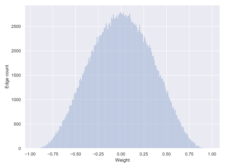

# Graph Thresholding

[](https://doi.org/10.5281/zenodo.7614763)


Repository for thresholding code, based on dissertation research. We use
a number of methods to analyse a weighted graph in order to suggest an
optimal threshold for the graph.

The components of this repository are:
 - C++ threshold analysis code
 - C++ threshold code
 - Bash threshold script
 - script to output a histogram of the edge weights of a graph
 - Python3 Jupyter notebook to analyse the results of the thresholding analysis code

---
## Installation
### C++ program

Compiling also installs [igraph](igraph.org/c/)-0.8.0, so you will need to have
igraph dependency (libxml2) installed beforehand
(see [below](#optionalinstructionsforlibxml2)).

    git clone git@github.com:carissableker/thresholding.git
    cd thresholding

To compile:

    make

Executables will be in `bin` folder.

### Scripts

The bash script `absolute_global_threshold` uses awk, and should be executable.

The bash script `edge_weight_histogram` also uses awk to calculate the
bin counts, and uses Python3 (including seaborn, matplotlib, and pandas) to produce the visualization.

### Jupyter notebook

The notebook uses the module `combine_analysis_results.py` (supplied) as well as seaborn, matplotlib, and pandas. 

---
## Usage

Graphs need to be in `.ncol` format to be read correctly
[igraph_read_graph_ncol](https://igraph.org/c/doc/igraph-Foreign.html#igraph_read_graph_ncol).
The format is defined by
[Large Graph Layout](http://lgl.sourceforge.net/#FileFormat).
In this application, it is a simple weighted, whitespace separated edge list. Vertex names cannot contain whitespace.

  vertex<sub>1</sub>⇥vertex<sub>2</sub>⇥weight<sub>1,2</sub> <br>
  vertex<sub>1</sub>⇥vertex<sub>3</sub>⇥weight<sub>1,3</sub> <br>
  &middot; <br>
  &middot; <br>
  &middot; <br>

### 1. Graph analysis

It is recommended to first view a histogram of the edge weights:

```bash
$ ./bin/edge_weight_histogram <GRAPH FILE PATH> <OUTPUT FILE PATH> <BIN WIDTH>
```
This will create a tab separated file with bin counts in
`<OUTPUT FILE PATH>.tsv.`
and a SVG figure of the histogram at `<OUTPUT FILE PATH>.svg`.
The histogram can be used to decide on lower and upper bounds on the thresholds.

For analysis of the graph, run the `analysis` program.

```bash
$ ./bin/analysis --help

    Usage: 
    ./bin/analysis [-OPTIONS]... <GRAPH FILE PATH> <OUTPUT FILE PATH> 

    Graph has to be in .ncol format. 
    Output file path is the prefix to the results files, which will be of the form: 
        <OUTPUT FILE PATH>.pid.<method_name>.txt

    Options: 
      -l  --lower                  <value>     lower bound on thresholds to test (default 0.5)
      -u  --upper                  <value>     upper bound on thresholds to test (default 0.99)
      -i  --increment              <value>     threshold increment (default 0.01)
      -w  --windowsize             <value>     sliding window size for spectral method (default 5)
      -p  --minimumpartitionsize   <value>     minimum size of graph or subgraph after threshold (default 10)
      -n  --num_samples            <value>     number of samples for significance and power calculations (default NULL)
      -b  --bonferroni_correction              switch to perform bonferroni corrections in significance and power calculations (default FALSE)
      -c  --minimum_cliquesize     <value>     minimum size of maximal cliques in maximal clique count (default 5)
      -m  --methods                <value>     comma separated list of methods (defaults to none)
                                                   0 - all
                                                   1 - significance and power calculations (only valid for Pearson CC)
                                                   2 - local-global
                                                   3 - scale free
                                                   4 - maximal cliques
                                                   5 - spectral methods
                                                   6 - random matrix theory
                                                   7 - clustering coefficient
                                                   8 - percolation
      -h  --help                               print this help and exit
```

### 2. Analysis of results

The output of graph analysis is a number of files containing statistics and
metrics of the graph. A Python3 module is supplied to
interactively analyse these files. Usage can be seen in the notebook 
found at [./example/HumanCellCycleSubset-ThresholdNotebook.ipynb](./example/HumanCellCycleSubset-ThresholdNotebook.ipynb). 

### 3. Threshold

For simple thresholding, the fastest is probably to use
the `./bin/absolute_global_threshold` script.

```bash
$ ./bin/absolute_global_threshold <input.ncol> <t> <output.ncol>
```

This thresholds the graph at |t|, i.e. removes all edges with absolute value smaller or equal to t.

Alternatively, `threshold` can also be used to threshold the graph

```bash
$ ./bin/threshold  --help

    Usage:
    ./bin/threshold [-OPTIONS]... <GRAPH FILE PATH> <OUTPUT FILE PATH>

    Graph has to be in .ncol format.

    One of the following options have to be given:
    Options:
      -a  --absolute              <value>     Threshold graph at absolute of <value>
      -l  --local-global          <value>     Use local-global method to threshold with alpha = <value>
      -r  --rank                  <value>     Use top <value> ranked edges per vertex to threshold graph
      -h  --help                              print this help and exit
```

---
## Example:
This example uses the human cell cycle data from Stanford, available at [Transcriptional regulation and function in the human cell cycle](http://www-sequence.stanford.edu/human_cell_cycle/). The graph is the probe-wise Pearson correlation of the normalized expression data, across the 13 time points (n=13). Since the original graph has over 23 million edges, the version used here is a random subset of 250 000 edges. 

The complete graph is avalible on Zenodo: 
[](https://doi.org/10.5281/zenodo.10532019). 

First we can take a look at the edge weight distribution:
```bash
$ ../bin/edge_weight_histogram HumanCellCycleSubset.ncol HumanCellCycleSubset-edgehist 0.01
Edge distribution at HumanCellCycleSubset-edgehist.tsv and HumanCellCycleSubset-edgehist.svg
$ head HumanCellCycleSubset-edgehist.tsv
bin_start	bin_end	bin_count
-0.96000	-0.95000	1
-0.94000	-0.93000	1
-0.93000	-0.92000	2
-0.92000	-0.91000	8
-0.91000	-0.90000	6
```



Now lets do the analysis of our graph. To make it time efficient, lets do percolation, significance and power, and scale-free. By default it will also calculate density at each threshold. We'll start at a lower threshold limit of 0.6, and leave the increment at the default of 0.01. Remember to give the number of samples using `-n`. 

```bash
../bin/analysis HumanCellCycleSubset.ncol HumanCellCycleSubset-result -l0.6 -m1,3,8 -n13

------------------------------------------------
input graph file:      HumanCellCycleSubset.ncol
output file prefix:    HumanCellCycleSubset-result.3932.
lower threshold:       0.6
upper threshold:       0.99
threshold increment:   0.01
------------------------------------------------
Loading graph ... done.
Number vertices:  7077
Number edges:     250000  (maximum possible number edges 25038426)
------------------------------------------------

Iterative thresholding
Number steps: 40

Step: 1, Threshold: 0.6		Vertices: 6639	Edges: 15905
Step: 2, Threshold: 0.61		Vertices: 6514	Edges: 14532
Step: 3, Threshold: 0.62		Vertices: 6365	Edges: 13228
Step: 4, Threshold: 0.63		Vertices: 6212	Edges: 12037
Step: 5, Threshold: 0.64		Vertices: 6046	Edges: 10852
.
.
.
Step: 31, Threshold: 0.9		Vertices: 81	Edges: 41
Step: 32, Threshold: 0.91		Vertices: 47	Edges: 24
Step: 33, Threshold: 0.92		Vertices: 20	Edges: 10
Step: 34, Threshold: 0.93 Graph too small, finished. 
Done. 
```

Lets do spectral methds as well: 
```bash
../bin/analysis HumanCellCycleSubset.ncol HumanCellCycleSubset-result -l0.6 -m5
```


Now lets see what files were created:
```bash
$ ls
HumanCellCycleSubset-result.3932.iterative.txt
HumanCellCycleSubset-result.3932.statistical_errors.txt
HumanCellCycleSubset-result.4152.iterative.txt
```
You can peruse these files yourself, or use the notebook to take a look. Open the notebook at ./example//HumanCellCycleSubset-ThresholdNotebook.ipynb and follow the instructions there. 

Once you have decided on a threshold, you can use either `absolute_global_threshold` or `threshold`. Suppose we decide on a global threshold of 0.79 for our graph, then use:
```bash
$ ../bin/absolute_global_threshold  HumanCellCycleSubset.ncol 0.79  HumanCellCycleSubset-0.79.ncol
```


---
## TODOs:

### Algorithmic
* Change Chi2 test of GOE to KS test for continuous distributions
* Add Spearman significance
* Consider positive and negative values separately

### Implementation wise
* Test cases
* Improve memory allocation and deallocation
* Make increment loop optional
* Consider support for Windows/Mac
* Generally improve C++ code (with help from a C++ developer)
* Fix igraph dependency in Makefile
* ?Other input/output formats

---
## Other

### Optional instructions for libxml2

If libxml2 is not already installed, the following is one way of installing it.
Another (preferable and easier) option is `apt-get`.

```bash
    wget ftp://xmlsoft.org/libxml2/libxml2-<version>.tar.gz
    tar -xzvf libxml2-<version>.tar.gz
    ./configure  --without-python --prefix=/my_optional path/
    make
    make install
```

And if you used a prefix:

```bash
    echo 'export PATH="/my_optional_path/bin:$PATH"
    export LD_LIBRARY_PATH="/my_optional_path/lib:$LD_LIBRARY_PATH"
    export LD_RUN_PATH="/my_optional_path/lib:$LD_RUN_PATH"' >> ~/.bashrc
    source ~/.bashrc
```
